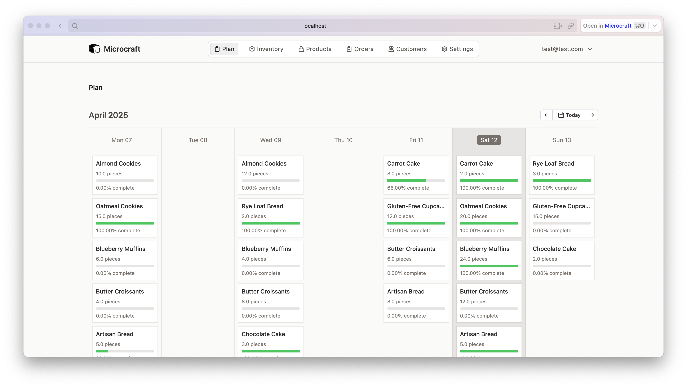
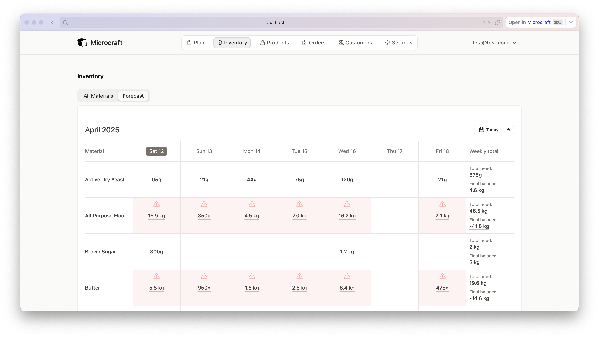
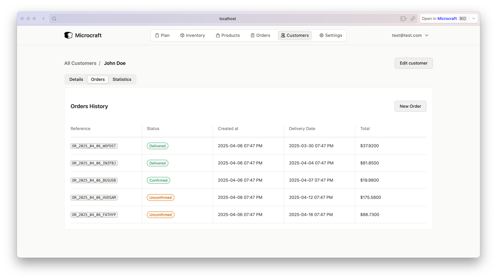

<div align="center">
  
  <h1>Microcraft</h1>
  <p>
      Just what you need and nothing more for managing artisanal micro-scale craft businesses.
  </p>
</div>
<br>
<br>
<br>

## Overview

Microcraft is an open-source ERP system designed specifically for small-scale artisanal manufacturers and craft businesses. It brings all essential business tools into one platform, helping you get off the ground quickly while minimizing costs—no need to pay for multiple separate platforms. From raw materials to finished products, Microcraft provides everything you need to manage your entire production process and make data-driven decisions as you grow.

## Screenshots

<div align="center">
  <table>
    <tr>
      <td>Production Planning Dashboard</td>
      <td>Inventory Management Interface</td>
    </tr>
    <tr>
      <td></td>
      <td></td>
    </tr>
  </table>

  <table>
    <tr>
      <td>Customer Orders Tracking</td>
      <td>Product Nutritional Facts Analysis</td>
    </tr>
    <tr>
      <td></td>
      <td></td>
    </tr>
  </table>
</div>

## User Guides

For detailed instructions on using Microcraft, check out our user guides:

- [Overview](guides/OVERVIEW.md) - Introduction to Microcraft
- [Catalog Management](guides/CATALOG.md) - Managing products and pricing
- [Inventory Control](guides/INVENTORY.md) - Tracking raw materials and stock
- [Order Management](guides/ORDERS.md) - Processing customer orders
- [Customer Management](guides/CUSTOMERS.md) - Managing your customer database
- [Business Intelligence](guides/REPORTS.md) - Reports and analytics
- [Settings](guides/SETTINGS.md) - Configuring your Microcraft installation

## Features

### 📋 Catalog Management

- [x] Product lifecycle management (from idea to production)
- [x] Cost and margin analysis
- [x] Allergen tracking
- [x] Multi-currency support
- [x] Nutritional facts
- [ ] Recipe/Bill of Materials management
- [ ] Variant management

### 📦 Inventory Control

- [x] Raw material stock tracking
- [x] Minimum/maximum stock levels
- [x] Cost tracking
- [x] Stock levels movement history
- [x] Allergen
- [x] Nutritional facts
- [x] Advanced inventory forecasting
- [ ] Unit conversion

### 🛍️ Sales & Order Management

- [x] Order processing workflow
- [x] Order status tracking
- [ ] Discounts and promotions
- [ ] Customer-specific pricing
- [ ] Delivery scheduling
- [ ] Basic invoicing
- [ ] Integration with WhatsApp Business
- [ ] Integration with e-commerce platforms (Shopify, WooCommerce, etc...)

### 👥 Customer Relationship Management

- [x] Customer database
- [x] Order history
- [x] Shipping & billing address management
- [ ] Loyatly programs
- [ ] Customer segmentation

### 📊 Business Intelligence

- [x] Cost analysis
- [x] Margin calculations
- [ ] Sales trends
- [ ] Inventory turnover
- [ ] Production efficiency metrics

### 🗓️ Production Planning

- [x] Production scheduling
- [ ] Quality control tracking
- [ ] Notifications

### 🗓️ Storefront

- [ ] Online ordering
- [ ] Mobile view
- [ ] Blog
- [ ] Billing

## Technology Stack

- **Backend**: Elixir + Ash Framework + Phoenix Framework
- **Database**: PostgreSQL
- **Frontend**: Phoenix LiveView + TailwindCSS

## Getting Started

### Prerequisites

- Elixir 1.18+
- Erlang OTP 25+
- PostgreSQL 16+
- Node.js 18+ (for asset building)

### Installation

1. Clone the repository

   ```bash
   git clone https://github.com/puemos/microcraft.git
   cd microcraft
   ```

2. Install dependencies

   ```bash
   mix setup
   ```

3. Create and migrate database

   ```bash
   mix ash.setup
   ```

4. Start the Phoenix server
   ```bash
   mix phx.server
   ```

Now you can visit [`localhost:4000`](http://localhost:4000) from your browser.

## Contributing

We welcome contributions! Please feel free to submit a Pull Request. For major changes, please open an issue first to discuss what you would like to change.

## License

This project is licensed under the AGPLv3 License - see the [LICENSE](LICENSE) file for details.

## Support

If you need help with setup or have questions:

- Open an issue
- Check out our [documentation](guides/OVERVIEW.md)
